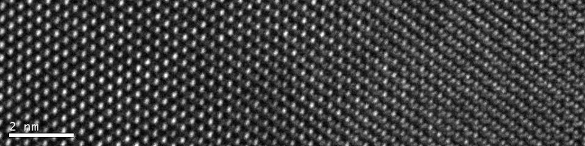

# PHSX815_Week1
This repository was created to store the projects from HW 1 and HW 2 for PHSX 815. HW 1 can be seen at the bottom of this readme file. HW 2 is explained here and has to do with the files stored in the HW 2 folder  in this repository

## HW 2 (See the HW 2 folder)
Files for HW 2 are all contained in the "HW 2" folder. There are 3 code files and 1 text file. These files are explained below.

### Random_python.py
This is the original python code that Dr. Rogan created to create several pseudo-random numbers and plot them on a histogram. It is included here as reference if you desire to compare the original code to the code that I have added. 

### Random_python_Write.py
This is the modified python code based heavily on Dr. Rogan's pseudo-random number generator code, Random_python.py, that I modifiedto write the random numbers to a .txt file called randomNums.txt. This .txt file is overwritten every time this file is compiled and run. 

### Random_python_ReadAndPlot.py
This is the modified python code based heavily on Dr. Rogan's random number histogram plotter, Random_python.py. This code reads in the random numbers in randomNums.txt, casts them as floats, and plots them as a histogram.  

### randomNums.txt
These are the random numbers created and stored in the myx array in Random_python_Write.py. The data seperator is the '\n' character.

## HW 1
This repository is to fulfill the requirements for HW 1 in PHSX 815. 

I also need to learn markdown so I will practice a few things from the [markdown cheatsheet](https://www.markdownguide.org/cheat-sheet/) provided by github. 

`fprintf('hello world')` since Matlab is the current programing language that I mainly use, but I still know Python basics `print('Hello World')`

Does this really let you include images? Look, a silicon lattice?

Some of the items in the cheat sheet don't seem to work specifically, the ==highlight== and the~subscript~. Although this~might~work. Nope it didn't.

That's enough for now. Onto other HW.
